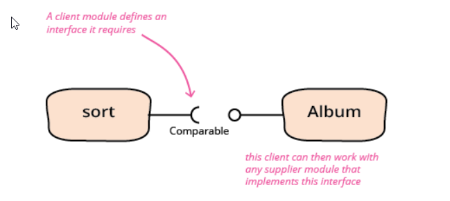

#     Topics 
- [Topics](#topics)
  * [Introduction:](#introduction)
    + [Topic no.1](#topic-no1)
      - [Required Interface](#required-interface)
    + [Topic no.2](#topic-no2)
      - [Mapstruct](#mapstruct)
    + [Topic no.3](#topic-no3)
      - [Log4j Marker Filter](#log4j-marker-filter)
    + [Topic no.4](#topic-no4)
      - [Custom Annotation](#custom-annotation)
        * [Simple Processor](#simple-processor)
        * [AOP Processor](#aop-processor)
    + [Topic no.5](#topic-no5)
      - [Awaitility ](#Awaitility )
    + [Topic no.6](#topic-no6)
      - [Junit-5 Examples](#Junit-5-Examples)
    + [Topic no.7](#topic-no7)
          - [Jmeter-Dockerized](#Jmeter-Dockerized)
    + [Topic no.8](#topic-no8)
          - [Vault-Example](#Vault-Example)

        
## Introduction:
This repo will be serving the base having multiple modules where concepts will be practise. 

### Topic no.1
#### Required Interface #####
Required Interfaces concept forwarded by 'Martin Fowler'. Explanation can be followed @ https://martinfowler.com/bliki/RequiredInterface.html

###### Example : ###### 
client : `required-interface-client-layer`  
service : `required-interface-service-layer`

client need to use `PrintService` from service layer, client is already dependency of Service layer, so normally if we
want to access PrintService class we need to add service as dependency and as result it would introduce cyclic dependency
and will not be able to compile. 

In order to make it working, we define client base interface and we implement them in service and use what we want from service. 

`RequiredInterface` in client module and its implementation in service layer tells the whole story that how to enable client 
to use services from parent layer. 

### Topic no.2
#### Mapstruct #####
MapStruct is a code generator that greatly simplifies the implementation of mappings between Java bean types based on a convention over configuration approach.

The generated mapping code uses plain method invocations and thus is fast, type-safe and easy to understand.

###### Example : ###### 
`Credential(username, password)` -----mapping to ---->>> `CredentialDto` using interface `CredentialMapper`
 
  for more examples explore  https://github.com/mapstruct/mapstruct-examples

### Topic no.3
#### Log4j Marker Filter #####
Log4j has ability to distinguish between logs and funnel out into dedicated files, this all can be achieved by using
Marker filter.
Module <Strong> logging </Strong> has implementation of Maker concepts, where various logs are funnel out to their dedicated log files. 
`log42.xml` has implementation of seperation logic.  
`            <MarkerFilter marker="SPECIFIC" onMatch="ACCEPT" onMismatch="DENY"></MarkerFilter>`

### Topic no.4
#### Custom Annotation #####
Module `customannotation` will contain code to create custom annotation and then process with two approaches
##### Simple Processor #####
Normal Annotation processor 
##### AOP Processor ##### 
Aspect Oriented Annotation
Having @Identifier annotation on method, based on age it will be executed and when the age is below the limit 
it will throw exception and will not provide required data for that person. 

### Topic no.5
#### Awaitility  #####
Awaitility is a small Java DSL for synchronizing asynchronous operations
###### Example : ###### 
A simple asynchronous service which increments a counter and sleep for some time before get initialized. 
The example is proof of concept that awaitility make the test wait until a condition is meet and then 
assert the output. 

### Topic no.6 
#### Junit-5-Examples ####
Here, i will try to provide examples for 
* Extension
  * Tried three extension like Parameter resolver, Exceptionhandler and postprocessor exception
  * LoggingExtensionTest is describing the test usge of all above extensions. 
* Parameterized Tests
 
### Topic no.7 
#### Jmeter-Dockerized ####
Run a basic hello world Jmeter testing scenario in dockerized environment with master-slave
configuration.
`docker-compose.yml` will spawn Master docker and its slaved to run a basic jmeter scenario prepared 
in jmeter i.e `scenario.jmx`. 
#### Jmeter-Prometheus-Grafana ####
Grafana : http://localhost:3000  
Prometheus: http://localhost:9090  
<Strong><i>Master-Slave0-Slave1 ---(sendData)---> Prometheus<i></Strong>
##### How to Run  #####
* `docker-compose --profile monitor up --build`
* add prometheus datasource to Grafana (http://localhost:9090 - Access 'Browser')
* `docker-compose --profile jmeter up --build -d`  
Note: Ideally no profile is required but to till the writing of this note i was not able to correctly configure datasource 

### Topic no.8
#### Vault-Example #####
A docker vault in development mode spins up and basic credentials added 
via `http://localhost:8200` and could be read with help of VaultTemplate class. 
##### How to Run  #####
`http://localhost:8200`\
`docker-compose up -d` 

